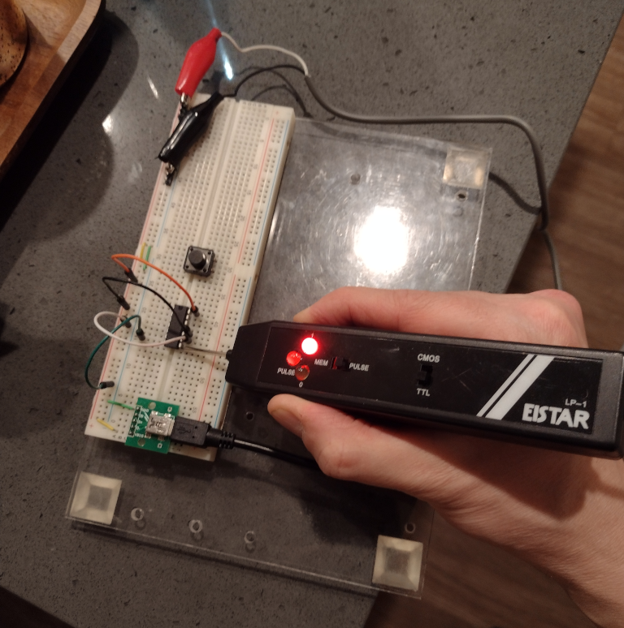
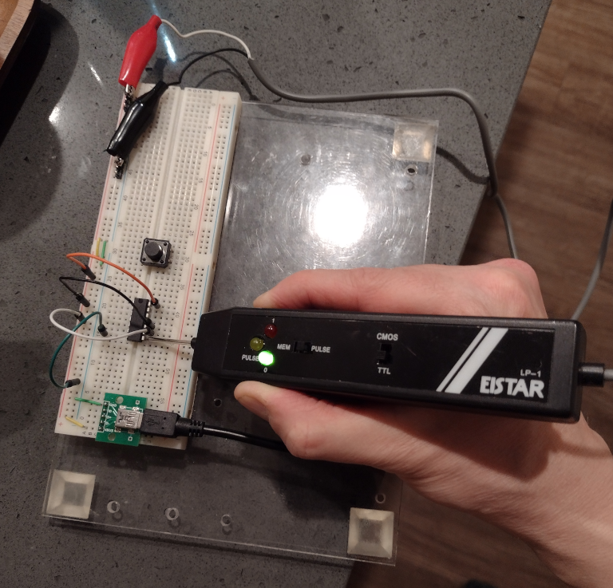

# NXP 74HC00N Quad 2-input NAND Gate

This was in my grab-bag of chips.

<a href="arpoison.net/~steve/datasheets/74HC00N.pdf">Data sheet</a>.

## Pins

14: Vcc
 7: Gnd

NAND Gates

1 & 2 in : 3 out
4 & 5 in : 6 out
9 & 10 in : 8 out
12 & 13 in : 11 out

## Results

Truth Table

A B Out
0 0 1
1 0 1
0 1 1
1 1 0
