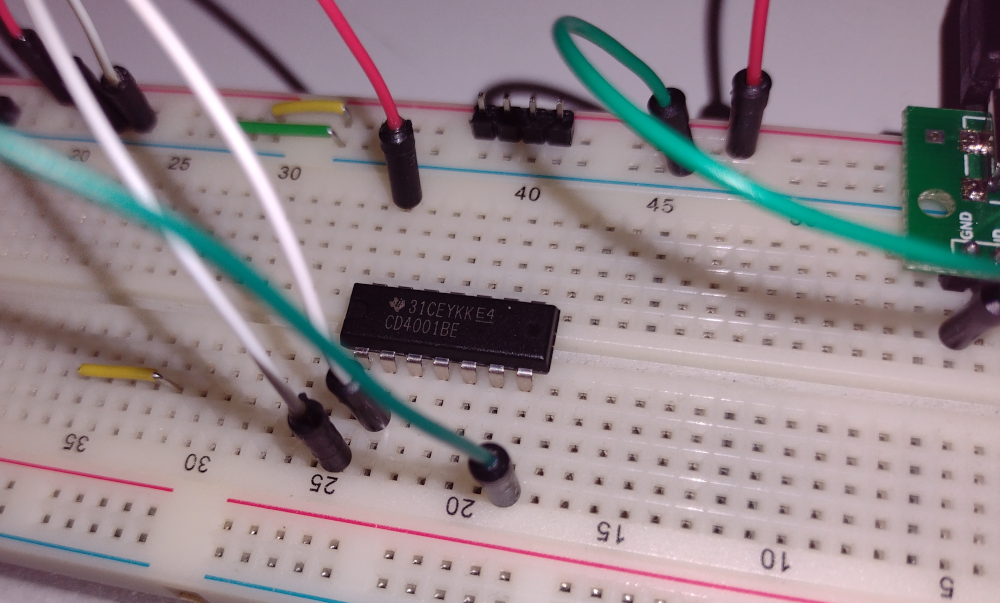
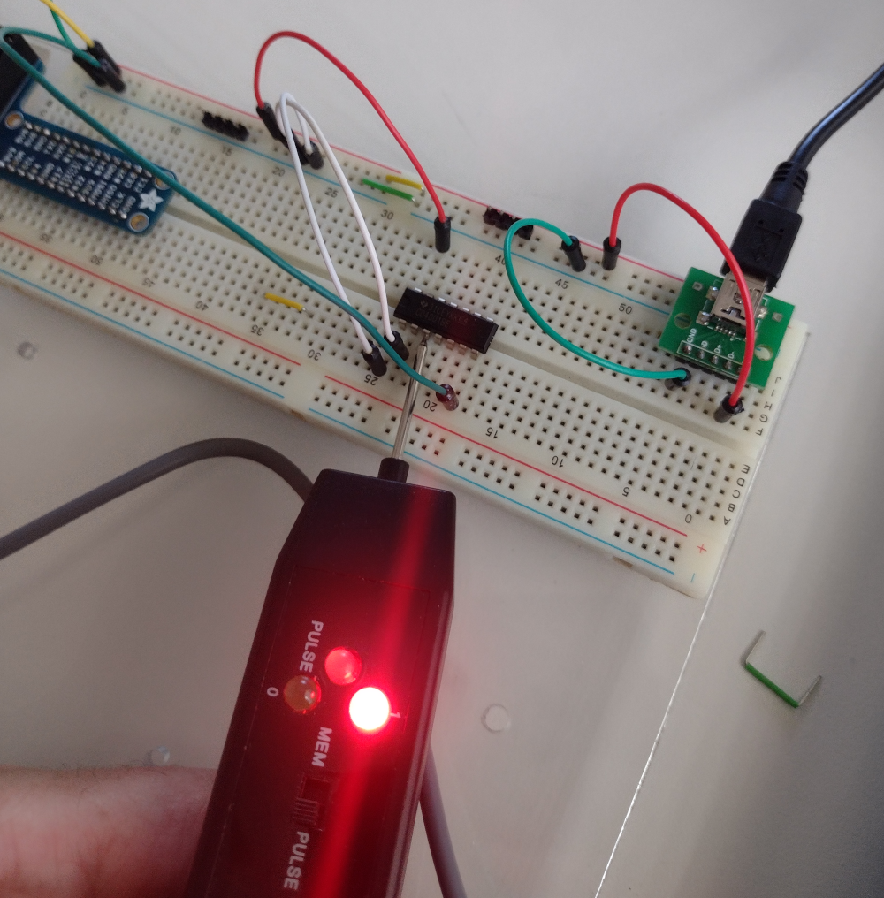

# TI CD4001BE Quad 2-input NOR gate

Texas Instruments CD4001BE CMOS Quad 2-input NOR gate in a 14 pin DIP.

Circuit was connected based on the [CD4001B Data Sheet](https://www.ti.com/lit/ds/symlink/cd4001b-mil.pdf?ts=175216859297).

Inputs were connected to VBUS or GND from the USB power source.

Eistar [LP-1 Logic Probe](https://www.arcade-museum.com/manuals-test-equipment/LP-1_Logic_Probe.pdf) was used to check logic levels.

## Pins

 1: Gate 1 input 
 2: Gate 1 input 
 3: Gate 1 output 
 7: VSS (ground) 
14: VDD (power)

## Results

Logic outputs agree with the table below.

**Truth Table**

A|B|Out
-|-|--
|0|0|1
|1|0|0
|0|1|0
|1|1|0

