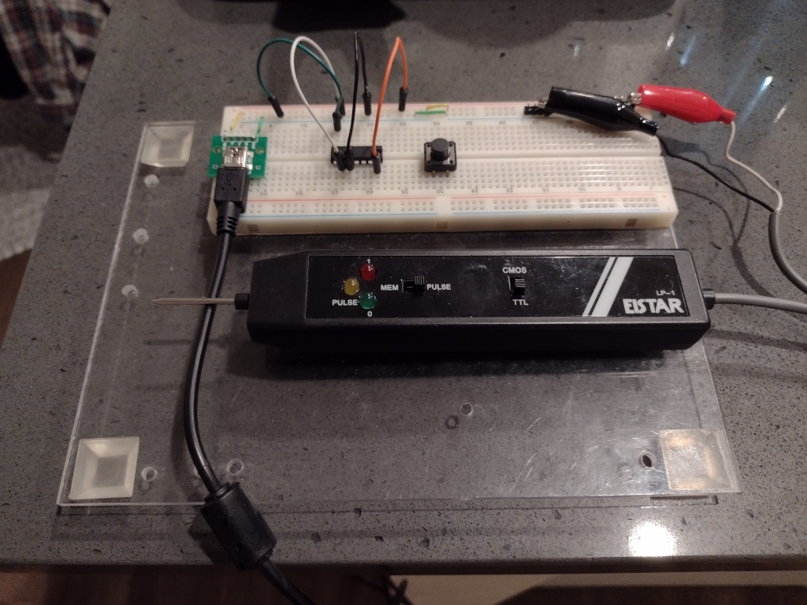

# Digital Circuit Experiments

A series of electronics-lab type projects to study digital circuit components.

My testing apparatus consists of a breadboard mounted on plexiglas, a USB breakout board power source, and a logic probe.

Connections are made with small jumper wires.

## Diode Logic

Todo

## Transistor Logic

Todo

## Integrated Circuits

* 74HC00N
* CD4040BE
